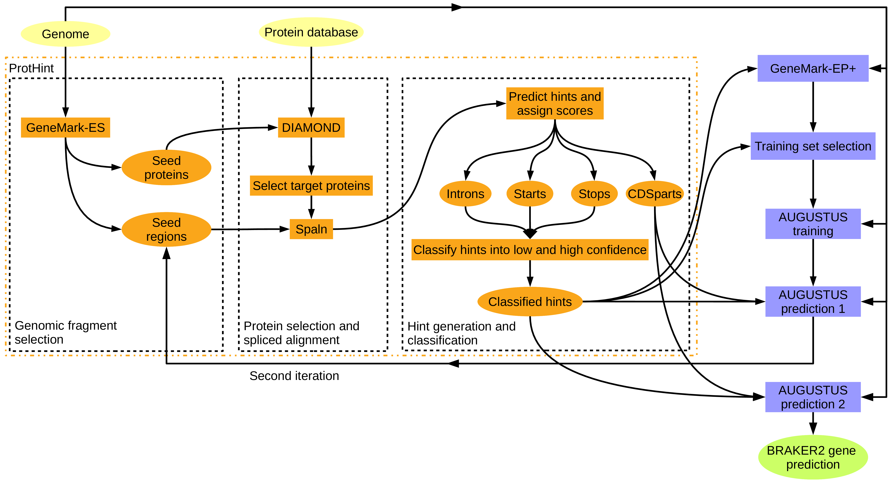

 

# BRAKER User Guide

News
====

Here is a recording of the first BGA23 workshop session on BRAKER. If learning by watching videos is easy for you, consider watching that: https://www.youtube.com/watch?v=UXTkJ4mUkyg

BRAKER3 is now in https://usegalaxy.eu/ 

Contacts for Repository 
========================

TSEBRA & BRAKER3 related:

   * Lars Gabriel, University of Greifswald, Germany, lars.gabriel@uni-greifswald.de

BRAKER & AUGUSTUS related:

   * Katharina J. Hoff, University of Greifswald, Germany, katharina.hoff@uni-greifswald.de, +49 3834 420 4624

GeneMark related:

   * Mark Borodovsky, Georgia Tech, U.S.A., borodovsky@gatech.edu

   * Tomas Bruna, Joint Genome Institute, U.S.A., bruna.tomas@gmail.com

   * Alexandre Lomsazde, Georgia Tech, U.S.A., alexandre.lomsadze@bme.gatech.edu

Core Authors of BRAKER
=================

<b id="aff1">[a]</b> University of Greifswald, Institute for Mathematics and Computer Science, Walther-Rathenau-Str. 47, 17489 Greifswald, Germany

<b id="aff2">[b]</b> University of Greifswald, Center for Functional Genomics of Microbes, Felix-Hausdorff-Str. 8, 17489 Greifswald, Germany

<b id="aff3">[c]</b> Joint Georgia Tech and Emory University Wallace H Coulter Department of Biomedical Engineering, 30332 Atlanta, USA

<b id="aff4">[d]</b> School of Computational Science and Engineering, 30332 Atlanta, USA

<b id="aff5">[e]</b> Moscow Institute of Physics and Technology, Moscow Region 141701, Dolgoprudny, Russia

![braker2-team-2\[fig10\]](docs/figs/mario.png)![braker2-team-1\[fig11\]](docs/figs/alex-katharina-tomas.png)![braker2-team-3\[fig12\]](docs/figs/lars.jpg)![braker2-team-4\[fig13\]](docs/figs/mark.png)

Figure 1: Current BRAKER authors, from left to right: Mario Stanke, Alexandre Lomsadze, Katharina J. Hoff, Tomas Bruna, Lars Gabriel, and Mark Borodovsky. We acknowledge that a larger community of scientists contributed to the BRAKER code (e.g. via pull requests).

Funding
=======

The development of BRAKER1, BRAKER2, and BRAKER3 was supported by the National Institutes of Health (NIH) [GM128145 to M.B. and M.S.]. Development of BRAKER3 was partially funded by Project Data Competency granted to K.J.H. and M.S. by the government of Mecklenburg-Vorpommern, Germany.

Related Software
================
The Transcript Selector for BRAKER (TSEBRA) is available at https://github.com/Gaius-Augustus/TSEBRA .

GeneMark-ETP, one of the gene finders at the core of BRAKER, is available at https://github.com/gatech-genemark/GeneMark-ETP .

AUGUSTUS, the second gene finder at the core of BRAKER, is available at https://github.com/Gaius-Augustus/Augustus .

GALBA, a BRAKER pipeline spin-off for using Miniprot or GenomeThreader to generate training genes, is available at https://github.com/Gaius-Augustus/GALBA .

Contents
========

-   [Authors](#authors-of-braker)
-   [Funding](#funding)
-   [What is BRAKER?](#what-is-braker)
-   [Keys to successful gene prediction](#keys-to-successful-gene-prediction)
-   [Overview of modes for running BRAKER](#overview-of-modes-for-running-braker)
-   [Container](#container)
-   [Installation](#installation)
    -   [Supported software versions](#supported-software-versions)
    -   [BRAKER](#braker)
        -   [Perl pipeline dependencies](#perl-pipeline-dependencies)
        -   [BRAKER components](#braker-components)
        -   [Bioinformatics software dependencies](#bioinformatics-software-dependencies)
            -   [Mandatory tools](#mandatory-tools)
            -   [Mandatory tools for BRAKER3](#mandatory-tools-for-braker3)
            -   [Optional tools](#optional-tools)
-   [Running BRAKER](#running-braker)
    -   [BRAKER pipeline modes](#different-braker-pipeline-modes)
        -   [BRAKER with RNA-Seq data](#braker-with-rna-seq-data)
        -   [BRAKER with protein data](#braker-with-protein-data)
        -   [BRAKER with RNA-Seq and protein data](#braker-with-rna-seq-and-protein-data)
        -   [BRAKER with short and long read RNA-Seq and protein data](#braker-with-short-and-long-read-rna-seq-and-protein-data)
    -   [Description of selected BRAKER command line options](#description-of-selected-braker-command-line-options)
        -   [--ab_initio](#--ab_initio)
        -   [--augustus_args=--some\_arg=bla](#--augustus_args--some_argbla)
        -   [--threads=INT](#--threadsint)
        -   [--fungus](#--fungus)
        -   [--useexisting](#--useexisting)
        -   [--crf](#--crf)
        -   [--lambda=int](#--lambdaint)
        -   [--UTR=on](#--utron)
        -   [--addUTR=on](#--addutron)
        -   [--stranded=+,-,.,...](#--stranded-)
	    -   [--makehub --email=your@mail.de](#--makehub---emailyourmailde)
        -   [--busco_lineage lineage](#--busco-lineage)
-   [Output of BRAKER](#output-of-braker)
-   [Example data](#example-data)
    -   [Data description](#data-description)
    -   [Testing BRAKER with RNA-Seq data](#testing-braker-with-rna-seq-data)
    -   [Testing BRAKER with proteins](#testing-braker-with-proteins)
    -   [Testing BRAKER with proteins and RNA-Seq](#testing-braker-with-proteins-and-rna-seq)
    -   [Testing BRAKER with pre-trained parameters](#testing-braker-with-pre-trained-parameters)
    -   [Testing BRAKER with genome sequence](#testing-braker-with-genome-sequence)
-   [Starting BRAKER on the basis of previously existing BRAKER runs](#starting-braker-on-the-basis-of-previously-existing-braker-runs)
-   [Bug reporting](#bug-reporting)
    -   [Reporting bugs on github](#reporting-bugs-on-github)
    -   [Common problems](#common-problems)
-   [Citing BRAKER and software called by BRAKER](#citing-braker-and-software-called-by-braker)
-   [License](#license)


What is BRAKER?
===============

The rapidly growing number of sequenced genomes requires fully automated methods for accurate gene structure annotation.
With this goal in mind, we have developed BRAKER1<sup name="a1">[R1](#f1)</sup><sup name="a0">[R0](#f0)</sup>, a combination of GeneMark-ET <sup name="a2">[R2](#f2)</sup> and AUGUSTUS <sup name="a3">[R3, ](#f3)</sup><sup name="a4">[R4](#f4)</sup>, that uses genomic and RNA-Seq data to automatically generate full gene structure annotations in novel genome.

However, the quality of RNA-Seq data that is available for annotating a novel genome is variable, and in some cases, RNA-Seq data is not available, at all.

BRAKER2 is an extension of BRAKER1 which allows for **fully automated training** of the gene prediction tools GeneMark-ES/ET/EP/ETP <sup name="a14">[R14, ](#f14)</sup><sup name="a15">[R15, ](#f15)<sup name="a17">[R17, ](#f17)</sup></sup><sup name="g1">[F1](#g1)</sup> and AUGUSTUS from RNA-Seq and/or protein homology information, and that integrates the extrinsic evidence from RNA-Seq and protein homology information into the **prediction**.

In contrast to other available methods that rely on protein homology information, BRAKER2 reaches high gene prediction accuracy even in the absence of the annotation of very closely related species and in the absence of RNA-Seq data.

BRAKER3 is the latest pipeline in the BRAKER suite. It enables the usage of RNA-seq **and** protein data in a fully automated pipeline to train and predict highly reliable genes with GeneMark-ETP and AUGUSTUS. The result of the pipeline is the combined gene set of both gene prediction tools, which only contains genes with very high support from extrinsic evidence.

In this user guide, we will refer to BRAKER1, BRAKER2, and BRAKER3 simply as **BRAKER** because they are executed by the same script (```braker.pl```).

Keys to successful gene prediction
==================================

-   Use a high quality genome assembly. If you have a huge number of very short scaffolds in your genome assembly, those short scaffolds will likely increase runtime dramatically but will not increase prediction accuracy.

-   Use simple scaffold names in the genome file (e.g. ```>contig1``` will work better than ```>contig1my custom species namesome putative function /more/information/  and lots of special characters %&!*(){}```). Make the scaffold names in all your fasta files simple before running any alignment program.

-   In order to predict genes accurately in a novel genome, the genome should be masked for repeats. This will avoid the prediction of false positive gene structures in repetitive and low complexitiy regions. Repeat masking is also essential for mapping RNA-Seq data to a genome with some tools (other RNA-Seq mappers, such as HISAT2, ignore masking information). In case of GeneMark-ES/ET/EP/ETP and AUGUSTUS, softmasking (i.e. putting repeat regions into lower case letters and all other regions into upper case letters) leads to better results than hardmasking (i.e. replacing letters in repetitive regions by the letter `N` for unknown nucleotide).

-   Many genomes have gene structures that will be predicted accurately with standard parameters of GeneMark-ES/ET/EP/ETP and AUGUSTUS within BRAKER. However, some genomes have clade-specific features, i.e. special branch point model in fungi, or non-standard splice-site patterns. Please read the options section \[options\] in order to determine whether any of the custom options may improve gene prediction accuracy in the genome of your target species.

-   Always check gene prediction results before further usage! You can e.g. use a genome browser for visual inspection of gene models in context with extrinsic evidence data. BRAKER supports the generation of track data hubs for the UCSC Genome Browser with MakeHub for this purpose.

Overview of modes for running BRAKER
====================================

BRAKER mainly features semi-unsupervised, extrinsic evidence data (RNA-Seq and/or protein spliced alignment information) supported training of GeneMark-ES/ET/EP/ETP<sup name="g1">[F1]</sup> and subsequent training of AUGUSTUS with integration of extrinsic evidence in the final gene prediction step. However, there are now a number of additional pipelines included in BRAKER. In the following, we give an overview of possible input files and pipelines:

-   Genome file, only. In this mode, GeneMark-ES is trained on the genome sequence, alone. Long genes predicted by GeneMark-ES are selected for training AUGUSTUS. Final predictions by AUGUSTUS are *ab initio*. This approach will likely yield lower prediction accuracy than all other here described pipelines. (see Figure [2](#fig1)),


![braker2-main-a\[fig1\]](docs/figs/braker-es.png)

Figure 2: BRAKER pipeline A: training GeneMark-ES on genome data, only; *ab initio* gene prediction withAUGUSTUS


-   Genome and RNA-Seq file from the same species (see figure [3](#fig2)); this approach is suitable for short read RNA-Seq libraries with a good coverage of the transcriptome, **important:** this approach requires that each intron is covered by many alignments, i.e. it does not work with assembled transcriptome mappings. In principle, also alignments of long read RNA-Seq data may lead to sufficient data for running BRAKER, but only if each transcript that will go into training was sequenced and aligned to the genome multiple times. Please be aware that at the current point in time, BRAKER does not officially support the integration of long read RNA-Seq data, yet.

![braker2-main-b\[fig2\]](docs/figs/braker1.png)

Figure 3: BRAKER pipeline B: training GeneMark-ET supported by RNA-Seq spliced alignment information, prediction with AUGUSTUS with that same spliced alignment information.


-   Genome file and database of proteins that may be of **unknown** evolutionary distance to the target species (see Figure [4](#fig3)); this approach is particularly suitable if no RNA-Seq data is available. This method will work better with proteins from species that are rather close to the target species, but accuracy will drop only very little if the reference proteins are more distant from the target species. **Important:** This approach requires a database of protein families, i.e. many representatives of each protein family must be present in the database. BRAKER has been tested with OrthoDB <sup name="a19">[R19](#f19)</sup>, successfully. The ProtHint <sup name="a18">[R18](#f18)</sup> protein mapping pipeline for generating required hints for BRAKER is available for download at <https://github.com/gatech-genemark/ProtHint>, the software on how to prepare the OrthoDB input proteins is available at https://github.com/tomasbruna/orthodb-clades. You may add proteins of a closely related species to the OrthoDB fasta file in order to incorporate additional evidence into gene prediction. We provide pre-partitioned OrthoDB v.11 clades for download at https://bioinf.uni-greifswald.de/bioinf/partitioned_odb11/ , and OrthoDB v.12 clades at https://bioinf.uni-greifswald.de/bioinf/partitioned_odb12/.

![braker2-main-c\[fig3\]](docs/figs/braker2_ep.png)

Figure 4: BRAKER pipeline C: training GeneMark-EP+ on protein spliced alignment, start and stop information, prediction with AUGUSTUS with that same information, in addition chained CDSpart hints. Proteins used here can be of any evolutionary distance to the target organism.

-   Genome file and RNA-Seq set(s) from the same species, and proteins that may be of **unknown** evolutionary distance to the target species (see figure [5](#fig4)); **important:** this approach requires a database of protein families, i.e. many representatives of each protein family must be present in the database, e.g. OrthoDB is suitable. (You may add proteins of a closely related species to the OrthoDB fasta file in order to incorporate additional evidence into gene prediction.)

![braker3-main-a\[fig4\]](docs/figs/braker3_etp.png)

Figure 5: BRAKER pipeline D: If necessary, download and alignment of RNA-Seq sets for the target species. Training of GeneMark-ETP supported by the RNA-Seq alignments and a large protein database (proteins can be of any evolutionary distance). Subsequently, AUGUSTUS training and prediction using the same extrinsic information together with the GeneMark-ETP results. The final prediction is the TSEBRA combination of the AUGUSTUS and GeneMark-ETP results.

Container
=========

We are aware that the "manual" installation of BRAKER3 and all its dependencies is tedious and really challenging without root permissions. Therefore, we provide a Docker container that has been developed to be run with Singularity. All information on this container can be found at https://hub.docker.com/r/teambraker/braker3

In short, build it as follows:

```
singularity build braker3.sif docker://teambraker/braker3:latest
```

Execute with:

```
singularity exec braker3.sif braker.pl
```

Test with:

```
singularity exec -B $PWD:$PWD braker3.sif cp /opt/BRAKER/example/singularity-tests/test1.sh .
singularity exec -B $PWD:$PWD braker3.sif cp /opt/BRAKER/example/singularity-tests/test2.sh .
singularity exec -B $PWD:$PWD braker3.sif cp /opt/BRAKER/example/singularity-tests/test3.sh .
export BRAKER_SIF=/your/path/to/braker3.sif # may need to modify
bash test1.sh
bash test2.sh
bash test3.sh
```
Few users want to run their analysis inside Docker (since root permissions are required). However, if that's your goal, you can run and test the container as follows

```
sudo docker run --user 1000:100 --rm -it teambraker/braker3:latest bash
bash /opt/BRAKER/example/docker-tests/test1.sh # BRAKER1
bash /opt/BRAKER/example/docker-tests/test2.sh # BRAKER2
bash /opt/BRAKER/example/docker-tests/test3.sh # BRAKER3
```
:warning: The container does not include Java/GUSHR/anything UTR related because we are currently not maintaining UTR prediction with BRAKER. It's buggy and unstable. Do not use it.

:warning: Users have reported that you need to manually copy the AUGUSTUS_CONFIG_PATH contents to a writable location before running our containers from Nextflow. Afterwards, you need to specify the writable AUGUSTUS_CONFIG_PATH as command line argument to BRAKER in Nextflow.

Good luck ;-)

Installation
============

:warning: **Warning:** If you previously used BRAKER1 and/or BRAKER2, please be aware that the usage changed in several aspects. Also, older GeneMark versions that linger in your `$PATH` variable might lead to unforeseen interferences, causing program failures. Please move all older GeneMark versions out of your `$PATH` (also e.g. the GeneMark in `ProtHint/dependencies`).

Supported software versions
---------------------------

At the time of release, this BRAKER version was tested with:

-   AUGUSTUS 3.5.0 <sup name="g2">[F2](#g2)</sup>

-   GeneMark-ETP (source see Dockerfile)

-   BAMTOOLS 2.5.1<sup name="a5">[R5](#f5)</sup>

-   SAMTOOLS 1.7-4-g93586ed<sup name="a6">[R6](#f6)</sup>

-   Spaln 2.3.3d <sup name="a8">[R8, ](#f8)</sup><sup name="a9">[R9, ](#f9)</sup><sup name="a10">[R10](#f10)</sup>

-   NCBI BLAST+ 2.2.31+ <sup name="a12">[R12, ](#f12)</sup><sup name="a13">[R13](#f13)</sup>

-   DIAMOND 0.9.24

-   cdbfasta 0.99

-   cdbyank 0.981

-   GUSHR 1.0.0

-   SRA Toolkit 3.00 <sup name="a22">[R14](#f14)</sup>

-   HISAT2 2.2.1 <sup name="a23">[R15](#f15)</sup>

-   BEDTOOLS 2.30 <sup name="a24">[R16](#f16)</sup>

-   StringTie2 2.2.1 <sup name="a25">[R17](#f17)</sup>

-   GFFRead 0.12.7  <sup name="a26">[R18](#f18)</sup>

-   compleasm 0.2.5 <sup name="a27">[R27](#f27)</sup>

BRAKER
-------

### Perl pipeline dependencies

Running BRAKER requires a Linux-system with `bash` and Perl. Furthermore, BRAKER requires the following CPAN-Perl modules to be
installed:

-   `File::Spec::Functions`

-   `Hash::Merge`

-   `List::Util`

-   `MCE::Mutex`

-   `Module::Load::Conditional`

-   `Parallel::ForkManager`

-   `POSIX`

-   `Scalar::Util::Numeric`

-   `YAML`

-   `Math::Utils`

-   `File::HomeDir`

For GeneMark-ETP, used when protein and RNA-Seq is supplied:

-   `YAML::XS`
-   `Data::Dumper`
-   `Thread::Queue`
-   `threads`

On Ubuntu, for example, install the modules with CPANminus<sup name="g4">[F4](#g4)</sup>: `sudo cpanm Module::Name`, e.g. `sudo cpanm Hash::Merge`.

BRAKER also uses a Perl module `helpMod_braker.pm` that is not available on CPAN. This module is part of the BRAKER release and does not require separate installation.

If you do not have root permissions on the Linux machine, try setting up an **Anaconda** (<https://www.anaconda.com/distribution/>) environment as follows:

```
wget https://repo.anaconda.com/archive/Anaconda3-2018.12-Linux-x86_64.sh
bash bin/Anaconda3-2018.12-Linux-x86_64.sh # do not install VS (needs root privileges)
conda install -c anaconda perl
conda install -c anaconda biopython
conda install -c bioconda perl-app-cpanminus
conda install -c bioconda perl-file-spec
conda install -c bioconda perl-hash-merge
conda install -c bioconda perl-list-util
conda install -c bioconda perl-module-load-conditional
conda install -c bioconda perl-posix
conda install -c bioconda perl-file-homedir
conda install -c bioconda perl-parallel-forkmanager
conda install -c bioconda perl-scalar-util-numeric
conda install -c bioconda perl-yaml
conda install -c bioconda perl-class-data-inheritable
conda install -c bioconda perl-exception-class
conda install -c bioconda perl-test-pod
conda install -c bioconda perl-file-which # skip if you are not comparing to reference annotation
conda install -c bioconda perl-mce
conda install -c bioconda perl-threaded
conda install -c bioconda perl-list-util
conda install -c bioconda perl-math-utils
conda install -c bioconda cdbtools
conda install -c eumetsat perl-yaml-xs
conda install -c bioconda perl-data-dumper
```

Subsequently install BRAKER and other software "as usual" while being in your conda environment. **Note:** There is a bioconda braker package, and a bioconda augustus package. They work. But they are usually lagging behind the development code of both tools on github. We therefore recommend manual installation and usage of lastest sources.

### BRAKER components

BRAKER is a collection of Perl and Python scripts and a Perl module. The main script that will be called in order to run BRAKER is `braker.pl`. Additional Perl and Python components are:

-   `filterGenemark.pl`

-   `filterIntronsFindStrand.pl`

-   `helpMod_braker.pm`

-   `findGenesInIntrons.pl`

-   `downsample_traingenes.pl`

-   `ensure_n_training_genes.py`

-   `get_gc_content.py`

-   `get_etp_hints.py`

All scripts (files ending with `*.pl` and `*.py`) that are part of BRAKER must be executable in order to run BRAKER. This should already be the case if you download BRAKER from GitHub. Executability may be overwritten if you e.g. transfer BRAKER on a USB-stick to another computer. In order to check whether required files are executable, run the following command in the directory that contains BRAKER Perl scripts:

    ls -l *.pl *.py

The output should be similar to this:

```
    -rwxr-xr-x 1 katharina katharina  18191 Mai  7 10:25 align2hints.pl
    -rwxr-xr-x 1 katharina katharina   6090 Feb 19 09:35 braker_cleanup.pl
    -rwxr-xr-x 1 katharina katharina 408782 Aug 17 18:24 braker.pl
    -rwxr-xr-x 1 katharina katharina   5024 Mai  7 10:25 downsample_traingenes.pl
    -rwxr-xr-x 1 katharina katharina   5024 Mai  7 10:23 ensure_n_training_genes.py
    -rwxr-xr-x 1 katharina katharina   4542 Apr  3  2019 filter_augustus_gff.pl
    -rwxr-xr-x 1 katharina katharina  30453 Mai  7 10:25 filterGenemark.pl
    -rwxr-xr-x 1 katharina katharina   5754 Mai  7 10:25 filterIntronsFindStrand.pl
    -rwxr-xr-x 1 katharina katharina   7765 Mai  7 10:25 findGenesInIntrons.pl
    -rwxr-xr-x 1 katharina katharina   1664 Feb 12  2019 gatech_pmp2hints.pl
    -rwxr-xr-x 1 katharina katharina   2250 Jan  9 13:55 log_reg_prothints.pl
    -rwxr-xr-x 1 katharina katharina   4679 Jan  9 13:55 merge_transcript_sets.pl
    -rwxr-xr-x 1 katharina katharina  41674 Mai  7 10:25 startAlign.pl
```

It is important that the `x` in `-rwxr-xr-x` is present for each script. If that is not the case, run

    `chmod a+x *.pl *.py`

in order to change file attributes.

You may find it helpful to add the directory in which BRAKER perl scripts reside to your `$PATH` environment variable. For a single bash session, enter:

```
    PATH=/your_path_to_braker/:$PATH
    export PATH
```

To make this `$PATH` modification available to all bash sessions, add the above lines to a startup script (e.g.`~/.bashrc`).

Bioinformatics software dependencies
------------------------------------

BRAKER calls upon various bioinformatics software tools that are not part of BRAKER. Some tools are obligatory, i.e. BRAKER will not run at all if these tools are not present on your system. Other tools are optional. Please install all tools that are required for running BRAKER in the mode of your choice.

### Mandatory tools

#### GeneMark-ETP

Download GeneMark-ETP<sup name="g1">[F1](#g1)</sup> from <http://github.com/gatech-genemark/GeneMark-ETP> or <https://topaz.gatech.edu/GeneMark/etp.for_braker.tar.gz>. Unpack and install GeneMark-ETP as described in GeneMark-ETP’s `README` file.

If already contained in your `$PATH` variable, BRAKER will guess the location of `gmes_petap.pl` or `gmetp.pl` automatically. Otherwise, BRAKER can find GeneMark-ES/ET/EP/ETP executables either by locating them in an environment variable `GENEMARK_PATH`, or by taking a command line argument (`--GENEMARK_PATH=/your_path_to_GeneMark_executables/`).

In order to set the environment variable for your current Bash session, type:

    export GENEMARK_PATH=/your_path_to_GeneMark_executables/

Add the above lines to a startup script (e.g. `~/.bashrc`) in order to make it available to all bash sessions.

You can check whether GeneMark-ES/ET/EP is installed properly by running the `check_install.bash` and/or executing examples in `GeneMark-E-tests` directory.

GeneMark-ETP is downward compatible, i.e. it covers the functionality of GeneMark-EP and GeneMark-ET in BRAKER, too.

Warning: installing GeneMark-ETP for BRAKER in conda environments has lead to multiple problems reported by users (Issues!). We can not offer support for conda installations. Please use the singularity image instead.

#### AUGUSTUS

Download AUGUSTUS from its master branch at <https://github.com/Gaius-Augustus/Augustus>. Unpack AUGUSTUS and install AUGUSTUS according to AUGUSTUS `README.TXT`. ***Do not use outdated AUGUSTUS versions from other sources, e.g. Debian package or Bioconda package! BRAKER highly depends in particular on an up-to-date Augustus/scripts directory, and other sources are often lagging behind.***

You should compile AUGUSTUS on your own system in order to avoid problems with versions of libraries used by AUGUSTUS. Compilation instructions are provided in the AUGUSTUS `README.TXT` file (`Augustus/README.txt`).

AUGUSTUS consists of `augustus`, the gene prediction tool, additional C++ tools located in `Augustus/auxprogs` and Perl scripts located in `Augustus/scripts`. Perl scripts must be executable (see instructions in section [BRAKER components](#executability).

The C++ tool `bam2hints` is an essential component of BRAKER when run with RNA-Seq. Sources are located in `Augustus/auxprogs/bam2hints`. Make sure that you compile `bam2hints` on your system (it should be automatically compiled when AUGUSTUS is compiled, but in case of problems with `bam2hints`, please read troubleshooting instructions in `Augustus/auxprogs/bam2hints/README`).

Since BRAKER is a pipeline that trains AUGUSTUS, i.e. writes species specific parameter files, BRAKER needs writing access to the configuration directory of AUGUSTUS that contains such files (`Augustus/config/`). If you install AUGUSTUS globally on your system, the `config` folder will typically not be writable by all users. Either make the directory where `config` resides recursively writable to users of AUGUSTUS, or copy the `config/` folder (recursively) to a location where users have writing permission.

AUGUSTUS will locate the `config` folder by looking for an environment variable `$AUGUSTUS_CONFIG_PATH`. If the `$AUGUSTUS_CONFIG_PATH`
environment variable is not set, then BRAKER will look in the path `../config` relative to the directory in which it finds an AUGUSTUS
executable. Alternatively, you can supply the variable as a command line argument to BRAKER (`--AUGUSTUS_CONFIG_PATH=/your_path_to_AUGUSTUS/Augustus/config/`). We recommend that you export the variable e.g. for your current bash
session:

```
    export AUGUSTUS_CONFIG_PATH=/your_path_to_AUGUSTUS/Augustus/config/
```

In order to make the variable available to all Bash sessions, add the above line to a startup script, e.g. `~/.bashrc`.

Please have a look at the [Dockerfile](Dockerfile) in case you want to install AUGUSTUS as Debian package. A number of scripts needs to be patched, then.

##### Important:

BRAKER expects the entire `config` directory of AUGUSTUS at `$AUGUSTUS_CONFIG_PATH`, i.e. the subfolders `species` with its contents (at least `generic`) and `extrinsic`! Providing a writable but empty folder at `$AUGUSTUS_CONFIG_PATH` will not work for BRAKER. If you need
to separate augustus binary and `$AUGUSTUS_CONFIG_PATH`, we recommend that you recursively copy the un-writable config contents to a writable location.

If you have a system-wide installation of AUGUSTUS at `/usr/bin/augustus`, an unwritable copy of `config` sits at `/usr/bin/augustus_config/`. The folder `/home/yours/` is writable to you. Copy with the following command (and additionally set the then required variables):

```
cp -r /usr/bin/Augustus/config/ /home/yours/
export AUGUSTUS_CONFIG_PATH=/home/yours/augustus_config
export AUGUSTUS_BIN_PATH=/usr/bin
export AUGUSTUS_SCRIPTS_PATH=/usr/bin/augustus_scripts
```

##### Modification of $PATH

Adding directories of AUGUSTUS binaries and scripts to your `$PATH` variable enables your system to locate these tools,
automatically. It is not a requirement for running BRAKER to do this, because BRAKER will try to guess them from the location of another
environment variable (`$AUGUSTUS_CONFIG_PATH`), or both directories can be supplied as command line arguments to `braker.pl`, but we recommend to add them to your `$PATH` variable. For your current bash session, type:

```
    PATH=:/your_path_to_augustus/bin/:/your_path_to_augustus/scripts/:$PATH
    export PATH
```

For all your BASH sessions, add the above lines to a startup script (e.g.`~/.bashrc`).

#### Python3

On Ubuntu, Python3 is usually installed by default, `python3` will be in your `$PATH` variable, by default, and BRAKER will automatically locate it. However, you have the option to specify the `python3` binary location in two other ways:

1.  Export an environment variable `$PYTHON3_PATH`, e.g. in your `~/.bashrc` file:

        export PYTHON3_PATH=/path/to/python3/

2.  Specify the command line option `--PYTHON3_PATH=/path/to/python3/` to `braker.pl`.

#### Bamtools

Download BAMTOOLS (e.g. `git clone https://github.com/pezmaster31/bamtools.git`). Install
BAMTOOLS by typing the following in your shell:

```
    cd your-bamtools-directory mkdir build cd build cmake .. make
```

If already in your `$PATH` variable, BRAKER will find bamtools, automatically. Otherwise, BRAKER can locate the bamtools binary either
by using an environment variable `$BAMTOOLS_PATH`, or by taking a command line argument (`--BAMTOOLS_PATH=/your_path_to_bamtools/bin/`<sup name="g6">[F6](#g6)</sup>). In order to set the environment variable e.g. for your current bash session, type:

```
    export BAMTOOLS_PATH=/your_path_to_bamtools/bin/
```

Add the above line to a startup script (e.g. `~/.bashrc`) in order to set the environment variable for all bash sessions.

#### NCBI BLAST+ or DIAMOND

You can use either NCBI BLAST+ or DIAMOND for removal of redundant training genes. You do not need both tools. If DIAMOND is present, it will be preferred because it is much faster.

Obtain and unpack DIAMOND as follows:

```
    wget http://github.com/bbuchfink/diamond/releases/download/v0.9.24/diamond-linux64.tar.gz
    tar xzf diamond-linux64.tar.gz
```

If already in your `$PATH` variable, BRAKER will find diamond, automatically. Otherwise, BRAKER can locate the diamond binary either by using an environment variable `$DIAMOND_PATH`, or by taking a command line argument (`--DIAMOND_PATH=/your_path_to_diamond`). In order to set the environment variable e.g. for your current bash session, type:

```
    export DIAMOND_PATH=/your_path_to_diamond/
```

Add the above line to a startup script (e.g. `~/.bashrc`) in order to set the environment variable for all bash sessions.

If you decide for BLAST+, install NCBI BLAST+ with `sudo apt-get install ncbi-blast+`.

If already in your `$PATH` variable, BRAKER will find blastp, automatically. Otherwise, BRAKER can locate the blastp binary either by using an environment variable `$BLAST_PATH`, or by taking a command line argument (`--BLAST_PATH=/your_path_to_blast/`). In order to set the environment variable e.g. for your current bash session, type:

```
    export BLAST_PATH=/your_path_to_blast/
```

Add the above line to a startup script (e.g. `~/.bashrc`) in order to set the environment variable for all bash sessions.

### Mandatory tools for BRAKER3

Following tools are required by GeneMark-ETP and it will try to locate them in your `$PATH` variable. So make sure to add their location to your `$PATH`, e.g.:
```
export PATH=$PATH:/your/path/to/Tool
```
For all tools below, add the above line to a startup script (e.g. `~/.bashrc`) in order to extend your `$PATH` variable for all bash sessions.

These software tools are only mandatory if you run BRAKER with RNA-Seq **and** protein data!

#### StringTie2

[StringTie2](https://github.com/skovaka/stringtie2) is used by GeneMark-ETP to assemble aligned RNA-Seq alignments. A precompiled version of StringTie2 can be downloaded from <https://ccb.jhu.edu/software/stringtie/#install>.

#### BEDTools

The software package [bedtools](https://bedtools.readthedocs.io/en/latest/) is required by GeneMark-ETP if you want to run BRAKER with both RNA-Seq and protein data. You can download bedtools from <https://github.com/arq5x/bedtools2/releases>. Here, you can either download a precompiled version `bedtools.static.binary`, e.g.
```
wget https://github.com/arq5x/bedtools2/releases/download/v2.30.0/bedtools.static.binary
mv bedtools.static.binary bedtools
chmod a+x
```
or you can download `bedtools-2.30.0.tar.gz` and compile it from source using `make`, e.g.
```
wget https://github.com/arq5x/bedtools2/releases/download/v2.30.0/bedtools-2.30.0.tar.gz
tar -zxvf bedtools-2.30.0.tar.gz
cd bedtools2
make
```
See <https://bedtools.readthedocs.io/en/latest/content/installation.html> for more information.

#### GffRead

[GffRead](https://github.com/gpertea/gffread) is a utility software required by GeneMark-ETP. It can be downloaded from <https://github.com/gpertea/gffread/releases/download/v0.12.7/gffread-0.12.7.Linux_x86_64.tar.gz> and installed with `make`, e.g.
```
wget https://github.com/gpertea/gffread/releases/download/v0.12.7/gffread-0.12.7.Linux_x86_64.tar.gz
tar xzf gffread-0.12.7.Linux_x86_64.tar.gz
cd gffread-0.12.7.Linux_x86_64
make
```

### Optional tools

#### Samtools

Samtools is not required for running BRAKER without GeneMark-ETP if all your files are formatted, correctly (i.e. all sequences should have short and unique
fasta names). If you are not sure whether all your files are fomatted correctly, it might be helpful to have Samtools installed because BRAKER can automatically fix certain format issues by using Samtools.

As a prerequisite for Samtools, download and install `htslib` (e.g. `git clone https://github.com/samtools/htslib.git`, follow the `htslib` documentation for installation).

Download and install Samtools (e.g. `git clone git://github.com/samtools/samtools.git`), subsequently follow Samtools documentation for installation).

If already in your `$PATH` variable, BRAKER will find samtools, automatically. Otherwise, BRAKER can find Samtools either by taking a
command line argument (`--SAMTOOLS_PATH=/your_path_to_samtools/`), or by using an environment variable `$SAMTOOLS_PATH`. For exporting the variable, e.g. for your current bash session, type:

```
    export SAMTOOLS_PATH=/your_path_to_samtools/
```

Add the above line to a startup script (e.g. `~/.bashrc`) in order to set the environment variable for all bash sessions.

#### Biopython

If Biopython is installed, BRAKER can generate FASTA-files with coding sequences and protein sequences predicted by AUGUSTUS and generate track data hubs for visualization of a BRAKER run with MakeHub <sup name="a16">[R16](#f16)</sup>.
These are optional steps. The first can be disabled with the command-line flag `--skipGetAnnoFromFasta`, the second can be activated by using the command-line options `--makehub --email=your@mail.de`, Biopython is not required if neither of these optional steps shall be performed.

On Ubuntu, install Python3 package manager with:

    `sudo apt-get install python3-pip`

Then, install Biopython with:

    `sudo pip3 install biopython`

#### cdbfasta

cdbfasta and cdbyank are required by BRAKER for correcting AUGUSTUS genes with in frame stop codons (spliced stop codons) using the AUGUSTUS script fix_in_frame_stop_codon_genes.py. This can be skipped with `--skip_fixing_broken_genes`.

On Ubuntu, install cdbfasta with:

```
    sudo apt-get install cdbfasta
```

For other systems, you can for example obtain cdbfasta from <https://github.com/gpertea/cdbfasta>, e.g.:

```
    git clone https://github.com/gpertea/cdbfasta.git
    cd cdbfasta
    make all
```

On Ubuntu, cdbfasta and cdbyank will be in your `$PATH` variable after installation, and BRAKER will automatically locate them. However, you have the option to specify the `cdbfasta` and `cdbyank` binary location in two other ways:

1.  Export an environment variable `$CDBTOOLS_PATH`, e.g. in your `~/.bashrc` file:

```
    export CDBTOOLS_PATH=/path/to/cdbtools/
```

2.  Specify the command line option `--CDBTOOLS_PATH=/path/to/cdbtools/` to `braker.pl`.

#### Spaln

**Note:** Support of stand-alone Spaln (ouside of ProtHint) within BRAKER is deprecated.

This tool is required if you run ProtHint or if you would like to run protein to genome alignments with BRAKER using Spaln outside of ProtHint. Using Spaln outside of ProtHint is a suitable approach only if an annotated species of short evolutionary distance to your target genome is available. We recommend running Spaln through ProtHint for BRAKER. ProtHint brings along a Spaln binary. If that does not work on your system, download Spaln from <https://github.com/ogotoh/spaln>. Unpack and install according to `spaln/doc/SpalnReadMe22.pdf`.

BRAKER will try to locate the Spaln executable by using an environment variable `$ALIGNMENT_TOOL_PATH`. Alternatively, this can be supplied as command line argument (`--ALIGNMENT_TOOL_PATH=/your/path/to/spaln`).

#### GUSHR

This tool is only required if you want either add UTRs (from RNA-Seq data) to predicted genes or if you want to train UTR parameters for AUGUSTUS and predict genes with UTRs. In any case, GUSHR requires the input of RNA-Seq data.

GUSHR is available for download at https://github.com/Gaius-Augustus/GUSHR. Obtain it by typing:

```
git clone https://github.com/Gaius-Augustus/GUSHR.git
```

GUSHR executes a GeMoMa jar file <sup name="a19">[R19, ](#f19)</sup> <sup name="a20">[R20, ](#f20)</sup> <sup name="a21">[R21](#f21)</sup>, and this jar file requires Java 1.8. On Ubuntu, you can install Java 1.8 with the following command:

```
sudo apt-get install openjdk-8-jdk
```

If you have several java versions installed on your system, make sure that you enable 1.8 prior running BRAKER with java by running

```
sudo update-alternatives --config java
```

and selecting the correct version.

#### Tools from UCSC

If you switch `--UTR=on`, bamToWig.py will require the following tools that can be downloaded from <http://hgdownload.soe.ucsc.edu/admin/exe>:

 * twoBitInfo

 * faToTwoBit

It is optional to install these tools into your $PATH. If you don't, and you switch `--UTR=on`, bamToWig.py will automatically download them into the working directory.

#### MakeHub

If you wish to automaticaly generate a track data hub of your BRAKER run, the MakeHub software, available at <https://github.com/Gaius-Augustus/MakeHub> is required. Download the software (either by running `git clone https://github.com/Gaius-Augustus/MakeHub.git`, or by
picking a release from <https://github.com/Gaius-Augustus/MakeHub/releases>. Extract the release package if you downloaded a release (e.g. `unzip MakeHub.zip` or `tar -zxvf MakeHub.tar.gz`.

BRAKER will try to locate the make_hub.py script by using an environment variable `$MAKEHUB_PATH`. Alternatively, this can be supplied as command line argument (`--MAKEHUB_PATH=/your/path/to/MakeHub/`). BRAKER can also try to guess the location of MakeHub on your system.

#### SRA Toolkit

If you want BRAKER to download RNA-Seq libraries from NCBI's SRA, the [SRA Toolkit](https://github.com/ncbi/sra-tools/wiki) is required. You can get a precompiled version of the SRA Toolkit from <http://daehwankimlab.github.io/hisat2/download/#version-hisat2-221>.

BRAKER will try to find executable binaries from the SRA Toolkit (fastq-dump, prefetch) by using an environment variable `$SRATOOLS_PATH`. Alternatively, this can be supplied as command line argument (`--SRATOOLS_PATH=/your/path/to/SRAToolkit/`). BRAKER can also try to guess the location of the SRA Toolkit on your system if the executables are in your `$PATH` variable.

#### HISAT2

If you want to use unaligned RNA-Seq reads, the [HISAT2](http://daehwankimlab.github.io/hisat2) software is required to map them to the genome.
A precompiled version of HISAT2 can be downloaded from <http://daehwankimlab.github.io/hisat2/download/#version-hisat2-221>.

BRAKER will try to find executable HISAT2 binaries (hisat2, hisat2-build) by using an environment variable `$HISAT2_PATH`. Alternatively, this can be supplied as command line argument (`--HISAT2_PATH=/your/path/to/HISAT2/`). BRAKER can also try to guess the location of HISAT2 on your system if the executables are in your `$PATH` variable.

#### compleasm

If you want to run TSEBRA within BRAKER in a BUSCO completeness maximizing mode, you need to install [compleasm](https://github.com/huangnengCSU/compleasm).

```
wget https://github.com/huangnengCSU/compleasm/releases/download/v0.2.4/compleasm-0.2.4_x64-linux.tar.bz2
tar -xvjf compleasm-0.2.4_x64-linux.tar.bz2 && \
```

Add the resulting folder compleasm_kit to your `$PATH` variable, e.g.:
```
export PATH=$PATH:/your/path/to/compleasm_kit
```

Compleasm requires pandas, which can be installed with:

```
pip install pandas
```

System dependencies
-------------------
BRAKER (braker.pl) uses getconf to see how many threads can be run on your system. On Ubuntu, you can install it with:

```
sudo apt-get install libc-bin
```


Running BRAKER
===============

Different BRAKER pipeline modes
--------------------------------

In the following, we describe “typical” BRAKER calls for different input data types. In general, we recommend that you run BRAKER on genomic sequences that have been softmasked for Repeats. BRAKER should only be applied to genomes that have been softmasked for repeats!

### BRAKER with RNA-Seq data

This approach is suitable for genomes of species for which RNA-Seq libraries with good transcriptome coverage are available and for which protein data is not at hand. The pipeline is illustrated in Figure [2](#fig1).

BRAKER has several ways to receive RNA-Seq data as input:

-   You can provide ID(s) of RNA-Seq libraries from SRA (in case of multiple IDs, separate them by comma) as argument to `--rnaseq_sets_ids`. The libraries belonging to the IDs are then downloaded automatically by BRAKER, e.g.:

    ```
        braker.pl --species=yourSpecies --genome=genome.fasta \
           --rnaseq_sets_ids=SRA_ID1,SRA_ID2
    ```

-   You can use local `FASTQ` file(s) of unaligned reads as input. In this case, you have to provide BRAKER with the ID(s) of the RNA-Seq set(s) as argument to `--rnaseq_sets_ids` and the path(s) to the directories, where the `FASTQ` files are located as argument to `--rnaseq_sets_dirs`. For each ID `ID`, BRAKER will search in these directories for one `FASTQ` file named `ID.fastq` if the reads are unpaired, or for two `FASTQ` files named `ID_1.fastq` and `ID_2.fastq` if they are paired.

    For example, if you have a paired library called 'SRA_ID1' and an unpaired library named 'SRA_ID2', you have to have a directory `/path/to/local/fastq/files/`, where the files `SRA_ID1_1.fastq`, `SRA_ID1_2.fastq`, and `SRA_ID2.fastq` reside. Then, you could run BRAKER with following command:

    ```
        braker.pl --species=yourSpecies --genome=genome.fasta \
           --rnaseq_sets_ids=SRA_ID1,SRA_ID2 \
           --rnaseq_sets_dirs=/path/to/local/fastq/files/
    ```

-   There are two ways of supplying BRAKER with RNA-Seq data as `bam` file(s). First, you can do it in the same way as you would supply `FASTQ` file(s): Provide the ID(s)/name(s) of your `bam` file(s) as argument to `--rnaseq_sets_ids` and specify directories where the `bam` files reside with `--rnaseq_sets_dirs`. BRAKER will automatically detect that these ID(s) are `bam` and not `FASTQ` file(s), e.g.:
    ```
        braker.pl --species=yourSpecies --genome=genome.fasta \
           --rnaseq_sets_ids=BAM_ID1,BAM_ID2 \
           --rnaseq_sets_dirs=/path/to/local/bam/files/
    ```
    Second, you can specify the paths to your `bam` file(s) directly, e.g.
can either extract RNA-Seq spliced alignment information from `bam` files, or it can use such extracted information, directly.
    ```
        braker.pl --species=yourSpecies --genome=genome.fasta \
           --bam=file1.bam,file2.bam
    ```

    Please note that we generally assume that bam files were generated with HiSat2 because that is the aligner that would also be executed by BRAKER3 with fastq input. If you want for some reason to generate the bam files with STAR, use the option `--outSAMstrandField intronMotif` of STAR to produce files that are compatible wiht StringTie in BRAKER3.

-   In order to run BRAKER with RNA-Seq spliced alignment information that has already been extracted, run:

    ```
        braker.pl --species=yourSpecies --genome=genome.fasta \
           --hints=hints1.gff,hints2.gff
    ```
    The format of such a hints file must be as follows (tabulator separated file):
    ```
        chrName b2h intron  6591    8003    1   +   .   pri=4;src=E
        chrName b2h intron  6136    9084    11  +   .   mult=11;pri=4;src=E
        ...
    ```
    The source `b2h` in the second column and the source tag `src=E` in the last column are essential for BRAKER to determine whether a hint has been generated from RNA-Seq data.

It is also possible to provide RNA-Seq sets in different ways for the same BRAKER run, any combination of above options is possible. It is not recommended to provide RNA-Seq data with `--hints` if you run BRAKER in ETPmode (RNA-Seq *and* protein data), because GeneMark-ETP won't use these hints!  

### BRAKER with protein data

This approach is suitable for genomes of species for which no RNA-Seq libraries are available. A large database of proteins (with possibly longer evolutionary distance to the target species) should be used in this case. This mode is illustrated in figure [9](#fig8).



Figure 9: BRAKER with proteins of any evolutionary distance. ProtHint protein mapping pipelines is used to generate protein hints. ProtHint automatically determines which alignments are from close relatives, and which are from rather distant relatives.

For running BRAKER in this mode, type:

    braker.pl --genome=genome.fa --prot_seq=proteins.fa

We recommend using OrthoDB as basis for `proteins.fa`. The instructions on how to prepare the input OrthoDB proteins are documented here: https://github.com/gatech-genemark/ProtHint#protein-database-preparation.

You can of course add additional protein sequences to that file, or try with a completely different database. Any database will need several representatives for each protein, though.

Instead of having BRAKER run ProtHint, you can also start BRAKER with hints already produced by ProtHint, by providing ProtHint's `prothint_augustus.gff` output:

    braker.pl --genome=genome.fa --hints=prothint_augustus.gff

The format of `prothint_augustus.gff` in this mode looks like this:

```
2R ProtHint intron 11506230 11506648 4 + . src=M;mult=4;pri=4
2R ProtHint intron 9563406  9563473  1 + . grp=69004_0:001de1_702_g;src=C;pri=4;
2R ProtHint intron 8446312  8446371  1 + . grp=43151_0:001cae_473_g;src=C;pri=4;
2R ProtHint intron 8011796  8011865  2 - . src=P;mult=1;pri=4;al_score=0.12;
2R ProtHint start  234524   234526   1 + . src=P;mult=1;pri=4;al_score=0.08;
```

The prediction of all hints with `src=M` will be enforced. Hints with `src=C` are 'chained evidence', i.e. they will only be incorporated if all members of the group (grp=...) can be incorporated in a single transcript. All other hints have `src=P` in the last column. Supported features in column 3 are `intron`, `start`, `stop` and `CDSpart`.

#### Training and prediction of UTRs, integration of coverage information

If RNA-Seq (and only RNA-Seq) data is provided to BRAKER as a bam-file, and if the genome is softmasked for repeats, BRAKER can automatically train UTR parameters for AUGUSTUS. After successful training of UTR parameters, BRAKER will automatically predict genes including coverage information form RNA-Seq data. Example call:

    braker.pl --species=yourSpecies --genome=genome.fasta \
       --bam=file.bam --UTR=on

**Warnings:**

   1) This feature is experimental!

   2) --UTR=on is currently not compatible with bamToWig.py as released in AUGUSTUS 3.3.3; it requires the current development code version from the github repository (git clone https://github.com/Gaius-Augustus/Augustus.git).

   3) --UTR=on increases memory consumption of AUGUSTUS. Carefully monitor jobs if your machine was close to maxing RAM without --UTR=on! Reducing the number of cores will also reduce RAM consumption.

   4) UTR prediction sometimes improves coding sequence prediction accuracy, but not always. If you try this feature, carefully compare results with and without UTR parameters, afterwards (e.g. in UCSC Genome Browser).

#### Stranded RNA-Seq alignments

For running BRAKER without UTR parameters, it is not very important whether RNA-Seq data was generated by a *stranded* protocol (because spliced alignments are ’artificially stranded’ by checking the splice site pattern). However, for UTR training and prediction, stranded libraries may provide information that is valuable for BRAKER.

After alignment of the stranded RNA-Seq libraries, separate the resulting bam file entries into two files: one for plus strand mappings, one for minus strand mappings. Call BRAKER as follows:

    braker.pl --species=yourSpecies --genome=genome.fasta \
        --bam=plus.bam,minus.bam --stranded=+,- \
        --UTR=on

You may additionally include bam files from unstranded libraries. Those files will not used for generating UTR training examples, but they will be included in the final gene prediction step as unstranded coverage information, example call:

    braker.pl --species=yourSpecies --genome=genome.fasta \
       --bam=plus.bam,minus.bam,unstranded.bam \
       --stranded=+,-,. --UTR=on

**Warning:** This feature is experimental and currently has low priority on our maintenance list!

### BRAKER with RNA-Seq **and** protein data

The native mode for running BRAKER with RNA-Seq and protein data. This will call GeneMark-ETP, which will use RNA-Seq and protein hints for training GeneMark-ETP. Subsequently, AUGUSTUS is trained on 'high-confindent' genes (genes with very high extrinsic evidence support) from the GeneMark-ETP prediction and a set of genes is predicted by AUGUSTUS. In a last step, the predictions of AUGUSTUS and GeneMark-ETP are combined using TSEBRA.

**Alignment of RNA-Seq reads**

GeneMark-ETP utilizes Stringtie2 to assemble RNA-Seq data, which requires that the aligned reads (BAM files) contain the XS (strand) tag for spliced reads. Therefore, if you align your reads with HISAT2, you must enable the --dta option, or if you use STAR, you must use the --outSAMstrandField intronMotif option. TopHat alignments include this tag by default.

To call the pipeline in this mode, you have to provide it with a protein database using `--prot_seq` (as described in [BRAKER with protein data](#braker-with-protein-data)), and RNA-Seq data either by their SRA ID so that they are downloaded by BRAKER, as unaligned reads in `FASTQ` format, and/or as aligned reads in `bam` format (as described in [BRAKER with RNA-Seq data](#braker-with-rna-seq-data)). You could also specify already processed extrinsic evidence using the `--hints` option. However, this is not recommend for a normal BRAKER run in ETPmode, as these hints won't be used in the GeneMark-ETP step. Only use `--hints` when you want to skip the GenMark-ETP step!

Examples of how you could run BRAKER in ETPmode:

```
    braker.pl --genome=genome.fa --prot_seq=orthodb.fa \
        --rnaseq_sets_ids=SRA_ID1,SRA_ID2 \
        --rnaseq_sets_dirs=/path/to/local/RNA-Seq/files/
```
```
    braker.pl --genome=genome.fa --prot_seq=orthodb.fa \
        --rnaseq_sets_ids=SRA_ID1,SRA_ID2,SRA_ID3
```
```
        braker.pl --genome=genome.fa --prot_seq=orthodb.fa \
            --bam=/path/to/SRA_ID1.bam,/path/to/SRA_ID2.bam
```

### BRAKER with short and long read RNA-Seq and protein data

A preliminary protocol for integration of assembled subreads from PacBio ccs sequencing in combination with short read Illumina RNA-Seq and protein database is described at https://github.com/Gaius-Augustus/BRAKER/blob/master/docs/long_reads/long_read_protocol.md

### BRAKER with long read RNA-Seq (only) and protein data

We forked GeneMark-ETP and hard coded that StringTie will perform long read assembly in that particular version. If you want to use this 'fast-hack' version for BRAKER, you have to prepare the BAM file with long read to genome spliced alignments outside of BRAKER, e.g.:

```
T=48 # adapt to your number of threads
minimap2 -t${T} -ax splice:hq -uf genome.fa isoseq.fa > isoseq.sam     
samtools view -bS --threads ${T} isoseq.sam -o isoseq.bam
```

Pull the adapted container:

```
singularity build braker3_lr.sif docker://teambraker/braker3:isoseq
```

Calling BRAKER3 with a BAM file of spliced-aligned IsoSeq Reads:

```
singularity exec -B ${PWD}:${PWD} braker3_lr.sif braker.pl --genome=genome.fa --prot_seq=protein_db.fa –-bam=isoseq.bam --threads=${T} 
```

**Warning** Do NOT mix short read and long read data in this BRAKER/GeneMark-ETP variant!

**Warning** The accuracy of gene prediction here heavily depends on the depth of your isoseq data. We verified with PacBio HiFi reads from 2022 that given sufficient completeness of the assembled transcriptome you will reach similar results as with short reads. However, we also observed a drop in accuracy compared to short reads when using other long read data sets with higher error rates and less sequencing depth.

Description of selected BRAKER command line options
----------------------------------------------------

Please run `braker.pl --help` to obtain a full list of options.

### --ab\_initio

Compute AUGUSTUS *ab initio* predictions in addition to AUGUSTUS predictions with hints (additional output files: `augustus.ab_initio.*`. This may be useful for estimating the quality of training gene parameters when inspecting predictions in a Browser.

### --augustus\_args="--some\_arg=bla"

One or several command line arguments to be passed to AUGUSTUS, if several arguments are given, separate them by whitespace, i.e. `"--first_arg=sth --second_arg=sth"`. This may be be useful if you know that gene prediction in your particular species benefits from a particular AUGUSTUS argument during the prediction step.

### --threads=INT

Specifies the maximum number of threads that can be used during computation. BRAKER has to run some steps on a single thread, others can take advantage of multiple threads. If you use more than 8 threads, this will not speed up all parallelized steps, in particular, the time consuming `optimize_augustus.pl` will not use more than 8 threads. However, if you don’t mind some threads being idle, using more than 8 threads will speed up other steps.

### --fungus

GeneMark-ETP option: run algorithm with branch point model. Use this option if you genome is a fungus.


### --useexisting

Use the present config and parameter files if they exist for 'species'; will overwrite original parameters if BRAKER performs an AUGUSTUS training.

### --crf

Execute CRF training for AUGUSTUS; resulting parameters are only kept for final predictions if they show higher accuracy than HMM parameters. This increases runtime!

### --lambda=int

Change the parameter $\lambda$ of the Poisson distribution that is used for downsampling training genes according to their number of introns (only genes with up to 5 introns are downsampled). The default value is $\lambda=2$. You might want to set it to 0 for organisms that mainly have single-exon genes. (Generally, single-exon genes contribute less value to increasing AUGUSTUS parameters compared to genes with many exons.)

### --UTR=on

Generate UTR training examples for AUGUSTUS from RNA-Seq coverage information, train AUGUSTUS UTR parameters and predict genes with AUGUSTUS and UTRs, including coverage information for RNA-Seq as evidence. *This is an experimental feature!*

If you performed a BRAKER run without --UTR=on, you can add UTR parameter training and gene prediction with UTR parameters (and only RNA-Seq hints) with the following command:

```
braker.pl --genome=../genome.fa --addUTR=on \
    --bam=../RNAseq.bam --workingdir=$wd \
    --AUGUSTUS_hints_preds=augustus.hints.gtf \
    --threads=8 --skipAllTraining --species=somespecies
```

Modify `augustus.hints.gtf` to point to the AUGUSTUS predictions with hints from previous BRAKER run; modify flaning_DNA value to the flanking region from the log file of your previous BRAKER run; modify some_new_working_directory to the location where BRAKER should store results of the additional BRAKER run; modify somespecies to the species name used in your previous BRAKER run.

### --addUTR=on

Add UTRs from RNA-Seq converage information to AUGUSTUS gene predictions using GUSHR. No training of UTR parameters and no gene prediction with UTR parameters is performed.

If you performed a BRAKER run without --addUTR=on, you can add UTRs results of a previous BRAKER run with the following command:

```
braker.pl --genome=../genome.fa --addUTR=on \
    --bam=../RNAseq.bam --workingdir=$wd \
    --AUGUSTUS_hints_preds=augustus.hints.gtf --threads=8 \
    --skipAllTraining --species=somespecies
```

Modify `augustus.hints.gtf` to point to the AUGUSTUS predictions with hints from previous BRAKER run; modify some_new_working_directory to the location where BRAKER should store results of the additional BRAKER run; this run will not modify AUGUSTUS parameters. We recommend that you specify the original species of the original run with `--species=somespecies`. Otherwise, BRAKER will create an unneeded species parameters directory `Sp_*`.

### --stranded=+,-,.,...

If `--UTR=on` is enabled, strand-separated bam-files can be provided with `--bam=plus.bam,minus.bam`. In that case, `--stranded=...` should hold the strands of the bam files (`+` for plus strand, `-` for minus strand, `.` for unstranded). Note that unstranded data will be used in the gene prediction step, only, if the parameter `--stranded=...` is set. *This is an experimental feature! GUSHR currently does not take advantage of stranded data.*


### --makehub --email=your@mail.de

If `--makehub` and `--email=your@mail.de` (with your valid e-mail adress) are provided, a track data hub for visualizing results with the UCSC Genome Browser will be generated using MakeHub (<https://github.com/Gaius-Augustus/MakeHub>).

### --gc_probability=DECIMAL

By default, GeneMark-ES/ET/EP/ETP uses a probability of 0.001 for predicting the donor splice site pattern GC (instead of GT). It may make sense to increase this value for species where this donor splice site is more common. For example, in the species *Emiliania huxleyi*, about 50% of donor splice sites have the pattern GC (https://media.nature.com/original/nature-assets/nature/journal/v499/n7457/extref/nature12221-s2.pdf, page 5).

### --busco_lineage=lineage

Use a species-specific lineage, e.g. arthropoda_odb10 for an arthropod. BRAKER does not support auto-typing of the lineage.

Specifying a BUSCO-lineage invokes two changes in BRAKER <sup name="a28">[R28](#f28)</sup>: 

1. BRAKER will run compleasm with the specified lineage in genome mode and convert the detected BUSCO matches into hints for AUGUSTUS. This may increase the number of BUSCOs in the augustus.hints.gtf file slightly.

2. BRAKER will invoke best_by_compleasm.py to check whether the braker.gtf file that is by default generated by TSEBRA has the lowest amount of missing BUSCOs compared to the augustus.hints.gtf and the genemark.gtf file. If not, the following decision schema is applied to re-run TSEBRA to minimize the missing BUSCOs in the final output of BRAKER (always braker.gtf). If an alternative and better gene set is created, the original braker.gtf gene set is moved to a directory called braker_original. Information on what happened during the best_by_compleasm.py run is written to the file best_by_compleasm.log.

![best_by_busco\[fig14\]](docs/figs/best_by_compleasm.jpg)

Please note that using BUSCO to assess the quality of a gene set, in particular when comparing BRAKER to other pipelines, does not make sense once you specified a BUSCO lineage. We recommend that you use other measures to assess the quality of your gene set, e.g. by comparing it to a reference gene set or running OMArk.

Output of BRAKER
=================

BRAKER produces several important output files in the working directory.

-   braker.gtf: Final gene set of BRAKER. This file may contain different contents depending on how you called BRAKER

    * in ETPmode: Final gene set of BRAKER consisting of genes predicted by AUGUSTUS and GeneMark-ETP that were combined and filtered by TSEBRA.

    * otherwise: Union of augustus.hints.gtf and reliable GeneMark-ES/ET/EP predictions (genes fully supported by external evidence). In `--esmode`, this is the union of augustus.ab_initio.gtf and all GeneMark-ES genes. Thus, this set is generally more sensitive (more genes correctly predicted) and can be less specific (more false-positive predictions can be present). This output is not necessarily better than augustus.hints.gtf, and it is not recommended to use it if BRAKER was run in ESmode.

-   braker.codingseq: Final gene set with coding sequences in FASTA format

-   braker.aa: Final gene set with protein sequences in FASTA format

-   braker.gff3: Final gene set in gff3 format (only produced if the flag `--gff3` was specified to BRAKER.

-   Augustus/*: Augustus gene set(s) in as gtf/conding/aa files

-   GeneMark-E*/genemark.gtf: Genes predicted by GeneMark-ES/ET/EP/EP+/ETP in GTF-format.

-   hintsfile.gff: The extrinsic evidence data extracted from RNAseq.bam and/or protein data.

-   braker_original/*: Genes predicted by BRAKER (TSEBRA merge) before compleasm was used to improve BUSCO completeness

-   bbc/*: output folder of best_by_compleasm.py script from TSEBRA that is used to improve BUSCO completeness in the final output of BRAKER

Output files may be present with the following name endings and formats:

-   Coding sequences in FASTA-format are produced if the flag `--skipGetAnnoFromFasta` was not set.

-   Protein sequence files in FASTA-format are produced if the flag `--skipGetAnnoFromFasta` was not set.

For details about gtf format, see <http://www.sanger.ac.uk/Software/formats/GFF/>. A GTF-format file contains one line per predicted exon. Example:

```
    HS04636 AUGUSTUS initial   966 1017 . + 0 transcript_id "g1.1"; gene_id "g1";
    HS04636 AUGUSTUS internal 1818 1934 . + 2 transcript_id "g1.1"; gene_id "g1";
```

The columns (fields) contain:

```
    seqname source feature start end score strand frame transcript ID and gene ID
```

If the `--makehub` option was used and MakeHub is available on your system, a hub directory beginning with the name `hub_` will be created. Copy this directory to a publicly accessible web server. A file `hub.txt` resides in the directory. Provide the link to that file to the UCSC Genome Browser for visualizing results.

Example data
============

An incomplete example data set is contained in the directory `BRAKER/example`. In order to complete the data set, please download the RNA-Seq alignment file (134 MB) with `wget`:

    cd BRAKER/example
    wget http://topaz.gatech.edu/GeneMark/Braker/RNAseq.bam

In case you have trouble accessing that file, there's also a copy available from another server:

    cd BRAKER/example
    wget http://bioinf.uni-greifswald.de/augustus/datasets/RNAseq.bam


The example data set was not compiled in order to achieve optimal prediction accuracy, but in order to quickly test pipeline components. The small subset of the genome used in these test examples is not long enough for BRAKER training to work well.

Data description
----------------

Data corresponds to the last 1,000,000 nucleotides of _Arabidopsis thaliana_'s chromosome Chr5, split into 8 artificial contigs.

RNA-Seq alignments were obtained by [VARUS](https://github.com/Gaius-Augustus/VARUS).

The protein sequences are a subset of [OrthoDB v10 plants proteins](https://v100.orthodb.org/download/odb10_plants_fasta.tar.gz).

List of files:

-   `genome.fa` - genome file in fasta format
-   `RNAseq.bam` - RNA-Seq alignment file in bam format (this file is not a part of this repository, it must be downloaded separately from <http://topaz.gatech.edu/GeneMark/Braker/RNAseq.bam>)
-   `RNAseq.hints` - RNA-Seq hints (can be used instead of RNAseq.bam as RNA-Seq input to BRAKER)
-   `proteins.fa` - protein sequences in fasta format

The below given commands assume that you configured all paths to tools by exporting bash variables or that you have the necessary tools in your $PATH.

The example data set also contains scripts `tests/test*.sh` that will execute below listed commands for testing BRAKER with the example data set. You find example results of AUGUSTUS and GeneMark-ES/ET/EP/ETP in the folder `results/test*`. Be aware that BRAKER contains several parts where random variables are used, i.e. results that you obtain when running the tests may not be exactly identical. To compare your test results with the reference ones, you can use the [compare_intervals_exact.pl](https://github.com/Gaius-Augustus/BRAKER/blob/master/scripts/compare_intervals_exact.pl) script as follows:

    # Compare CDS features
    compare_intervals_exact.pl --f1 augustus.hints.gtf --f2 ../../results/test${N}/augustus.hints.gtf --verbose
    # Compare transcripts
    compare_intervals_exact.pl --f1 augustus.hints.gtf --f2 ../../results/test${N}/augustus.hints.gtf --trans --verbose

Several tests use `--gm_max_intergenic 10000` option to make the test runs faster. It is not recommended to use this option in real BRAKER runs, the speed increase achieved by adjusting this option is negligible on full-sized genomes.

We give runtime estimations derived from computing on *Intel(R) Xeon(R) CPU E5530 @ 2.40GHz*.

Testing BRAKER with RNA-Seq data
--------------------------------

The following command will run the pipeline according to Figure [3](#fig2):

    braker.pl --genome genome.fa --bam RNAseq.bam --threads N --busco_lineage=lineage_odb10

This test is implemented in `test1.sh`, expected runtime is ~20 minutes.

Testing BRAKER with proteins
---------------------------------------------------------

The following command will run the pipeline according to Figure [4](#fig3):


    braker.pl --genome genome.fa --prot_seq proteins.fa --threads N --busco_lineage=lineage_odb10


This test is implemented in `test2.sh`, expected runtime is ~20 minutes.

Testing BRAKER with proteins and RNA-Seq
---------------------------------------------------------------------

The following command will run a pipeline that first trains GeneMark-ETP with protein and RNA-Seq hints and subsequently trains AUGUSTUS on the basis of GeneMark-ETP predictions. AUGUSTUS predictions are also performed with hints from both sources, see Figure [5](#fig4).

Run with local RNA-Seq file:

    braker.pl --genome genome.fa --prot_seq proteins.fa --bam ../RNAseq.bam --threads N --busco_lineage=lineage_odb10

This test is implemented in `test3.sh`, expected runtime is ~20 minutes.

Download RNA-Seq library from Sequence Read Archive (~1gb):

    braker.pl --genome genome.fa --prot_seq proteins.fa --rnaseq_sets_ids ERR5767212 --threads N --busco_lineage=lineage_odb10

This test is implemented in `test3_4.sh`, expected runtime is ~35 minutes.

Testing BRAKER with pre-trained parameters
------------------------------------------

The training step of all pipelines can be skipped with the option `--skipAllTraining`. This means, only AUGUSTUS predictions will be performed, using pre-trained, already existing parameters. For example, you can predict genes with the command:

```
    braker.pl --genome=genome.fa --bam RNAseq.bam --species=arabidopsis \
        --skipAllTraining --threads N
```

This test is implemented in `test4.sh`, expected runtime is ~1 minute.

Testing BRAKER with genome sequence
-----------------------------------

The following command will run the pipeline with no extrinsic evidence:

    braker.pl --genome=genome.fa --esmode --threads N

This test is implemented in `test5.sh`, expected runtime is ~20 minutes.

Testing BRAKER with RNA-Seq data and --UTR=on
---------------------------------------------
The following command will run BRAKER with training UTR parameters from RNA-Seq coverage data:

    braker.pl --genome genome.fa --bam RNAseq.bam --UTR=on --threads N

This test is implemented in `test6.sh`, expected runtime is ~20 minutes.

Testing BRAKER with RNA-Seq data and --addUTR=on
-------------------------------------------------
The following command will add UTRs to augustus.hints.gtf from RNA-Seq coverage data:

    braker.pl --genome genome.fa --bam RNAseq.bam --addUTR=on --threads N

This test is implemented in `test7.sh`, expected runtime is ~20 minutes.


Starting BRAKER on the basis of previously existing BRAKER runs
===============================================================

There is currently no clean way to restart a failed BRAKER run (after solving some problem). However, it is possible to start a new BRAKER run based on results from a previous run -- given that the old run produced the required intermediate results. We will in the following refer to the old working directory with variable `${BRAKER_OLD}`, and to the new BRAKER working directory with `${BRAKER_NEW}`. The file `what-to-cite.txt` will always only refer to the software that was actually called by a particular run. You might have to combine the contents of `${BRAKER_NEW}/what-to-cite.txt` with `${BRAKER_OLD}/what-to-cite.txt` for preparing a publication. The following figure illustrates at which points BRAKER run may be intercepted.


![braker-intercept\[fig8\]](docs/figs/braker-intercept.png)

Figure 10: Points for intercepting a BRAKER run and reusing intermediate results in a new BRAKER run.


Option 1: starting BRAKER with existing hints file(s) before training
---------------------------------------------------------------------

This option is only possible for BRAKER in ETmode or EPmode and <ins>not</ins> in ETPmode!

If you have access to an existing BRAKER output that contains hintsfiles that were generated from extrinsic data, such as RNA-Seq or protein sequences, you can recycle these hints files in a new BRAKER run. Also, hints from a separate ProtHint run can be directly used in BRAKER.

The hints can be given to BRAKER with `--hints ${BRAKER_OLD}/hintsfile.gff` option. This is illustrated in the test files `test1_restart1.sh`,  `test2_restart1.sh`, `test4_restart1.sh`. The other modes (for which this test is missing) cannot be restarted in this way.

Option 2: starting BRAKER after GeneMark-ES/ET/EP/ETP had finished, before training AUGUSTUS
----------------------------------------------------------------------------------

The GeneMark result can be given to BRAKER with `--geneMarkGtf ${BRAKER_OLD}/GeneMark*/genemark.gtf` option if BRAKER is run in ETmode or EPmode. This is illustrated in the test files `test1_restart2.sh`, `test2_restart2.sh`, `test5_restart2.sh`.

In ETPmode, you can either provide BRAKER with the results of the GeneMarkETP step manually, with `--geneMarkGtf ${BRAKER_OLD}/GeneMark-ETP/proteins.fa/genemark.gtf`, `--traingenes ${BRAKER_OLD}/GeneMark-ETP/training.gtf`, and `--hints ${BRAKER_OLD}/hintsfile.gff` (see `test3_restart1.sh` for an example), or you can specify the previous GeneMark-ETP results with the option `--gmetp_results_dir ${BRAKER_OLD}/GeneMark-ETP/` so that BRAKER can search for the files automatically (see `test3_restart2.sh` for an example).

Option 3: starting BRAKER after AUGUSTUS training
-------------------------------------------------

The trained species parameters for AGUSTUS can be passed with `--skipAllTraining` and `--species $speciesName` options. This is illustrated in `test*_restart3.sh` files. Note that in ETPmode you have to specify the GeneMark files as described in Option 2!

Bug reporting
=============

Before reporting bugs, please check that you are using the most recent versions of GeneMark-ES/ET/EP/ETP, AUGUSTUS and BRAKER. Also, check the list of [Common problems](#common-problems), and the Issue list on GitHub before reporting bugs. We do monitor open issues on GitHub. Sometimes, we are unable to help you, immediately, but we try hard to solve your problems.

Reporting bugs on GitHub
------------------------

If you found a bug, please open an issue at <https://github.com/Gaius-Augustus/BRAKER/issues> (or contact katharina.hoff@uni-greifswald.de or bruna.tomas@gatech.edu).

Information worth mentioning in your bug report:

Check in `braker/yourSpecies/braker.log` at which step `braker.pl` crashed.

There are a number of other files that might be of interest, depending on where in the pipeline the problem occurred. Some of the following files will not be present if they did not contain any errors.

-   `braker/yourSpecies/errors/bam2hints.*.stderr` - will give details on a bam2hints crash (step for converting bam file to intron gff file)

-   `braker/yourSpecies/hintsfile.gff` - is this file empty? If yes, something went wrong during hints generation - does this file contain hints from source “b2h” and of type “intron”? If not: GeneMark-ET will not be able to execute properly. Conversely, GeneMark-EP+ will not be able to execute correctly if hints from the source "ProtHint" are missing.

-   `braker/yourSpecies/spaln/*err` - errors reported by spaln

-   `braker/yourSpecies/errors/GeneMark-{ET,EP,ETP}.stderr` - errors reported by GeneMark-ET/EP+/ETP

-   `braker/yourSpecies/errors/GeneMark-{ET,EP,ETP).stdout` - may give clues about the point at which errors in GeneMark-ET/EP+/ETP occured

-   `braker/yourSpecies/GeneMark-{ET,EP,ETP}/genemark.gtf` - is this file empty? If yes, something went wrong during executing GeneMark-ET/EP+/ETP

-   `braker/yourSpecies/GeneMark-{ET,EP}/genemark.f.good.gtf` - is this file empty? If yes, something went wrong during filtering GeneMark-ET/EP+ genes for training AUGUSTUS

-   `braker/yourSpecies/genbank.good.gb` - try a “grep -c LOCUS genbank.good.gb” to determine the number of training genes for training AUGUSTUS, should not be low

-   `braker/yourSpecies/errors/firstetraining.stderr` - contains errors from first iteration of training AUGUSTUS

-   `braker/yourSpecies/errors/secondetraining.stderr` - contains errors from second iteration of training AUGUSTUS

-   `braker/yourSpecies/errors/optimize_augustus.stderr` - contains errors optimize\_augustus.pl (additional training set for AUGUSTUS)

-   `braker/yourSpecies/errors/augustus*.stderr` - contain AUGUSTUS execution errors

-   `braker/yourSpecies/startAlign.stderr` - if you provided a protein fasta file, something went wrong during protein alignment

-   `braker/yourSpecies/startAlign.stdout` - may give clues on at which point protein alignment went wrong

Common problems
---------------

-   *BRAKER complains that the RNA-Seq file does not correspond to the provided genome file, but I am sure the files correspond to each other!*

    Please check the headers of the genome FASTA file. If the headers are long and contain whitespaces, some RNA-Seq alignment tools will truncate sequence names in the BAM file. This leads to an error with BRAKER. Solution: shorten/simplify FASTA headers in the genome file before running the RNA-Seq alignment and BRAKER.

-   *GeneMark fails!*

    (a) GeneMark by default only uses contigs longer than 50k for training. If you have a highly fragmented assembly, this might lead to "no data" for training. You can override the default minimal length by setting the BRAKER argument `--min_contig=10000`.

    (b) see "[something] failed to execute" below.

-   *[something] failed to execute!*

    When providing paths to software to BRAKER, please use absolute, non-abbreviated paths. For example, BRAKER might have problems with `--SAMTOOLS_PATH=./samtools/` or `--SAMTOOLS_PATH=~/samtools/`. Please use `SAMTOOLS_PATH=/full/absolute/path/to/samtools/`, instead. This applies to all path specifications as command line options to `braker.pl`. Relative paths and absolute paths will not pose problems if you export a bash variable, instead, or if you append the location of tools to your $PATH variable.

-   *GeneMark-ETP in BRAKER dies with '/scratch/11232323': No such file or directory.*

    This appears to be related to sorting large files, and it's a system configuration depending problem. Solve it with `export TMPDIR=/tmp/` before calling BRAKER via Singularity.

-   *BRAKER cannot find the Augustus script XYZ...*

    Update Augustus from github with `git clone https://github.com/Gaius-Augustus/Augustus.git`. Do not use Augustus from other sources. BRAKER is highly dependent on an up-to-date Augustus. Augustus releases happen rather rarely, updates to the Augustus scripts folder occur rather frequently.

-   *Does BRAKER depend on Python3?*

    It does. The python scripts employed by BRAKER are not compatible with Python2.

-   *Why does BRAKER predict more genes than I expected?*

    If transposable elements (or similar) have not been masked appropriately, AUGUSTUS tends to predict those elements as protein coding genes. This can lead to a huge number genes. You can check whether this is the case for your project by BLASTing (or DIAMONDing) the predicted protein sequences against themselves (all vs. all) and counting how many of the proteins have a high number of high quality matches. You can use the output of this analysis to divide your gene set into two groups: the protein coding genes that you want to find and the repetitive elements that were additionally predicted.

-   *I am running BRAKER in Anaconda and something fails...*

    Update AUGUSTUS and BRAKER from github with `git clone https://github.com/Gaius-Augustus/Augustus.git` and `git clone https://github.com/Gaius-Augustus/BRAKER.git`. The Anaconda installation is great, but it relies on releases of AUGUSTUS and BRAKER - which are often lagging behind. Please use the current GitHub code, instead.

-   *Why and where is the GenomeThreader support gone?*

     BRAKER is a joint project between teams from University of Greifswald and Georgia Tech. While the group of Mark Bordovsky from Georgia Tech contributes GeneMark expertise, the group of Mario Stanke from University of Greifswald contributes AUGUSTUS expertise. Using GenomeThreader to build training genes for AUGUSTUS in BRAKER circumvents execution of GeneMark. Thus, the GenomeThreader mode is strictly speaking not part of the BRAKER project. The previous functionality of BRAKER with GenomeThreader has been moved to GALBA at <https://github.com/Gaius-Augustus/GALBA>. Note that GALBA has also undergone extension for using Miniprot instead of GenomeThreader.

-   *My BRAKER gene set has too many BUSCO duplicates!*

    AUGUSTUS within BRAKER can predict alternative splicing isoforms. Also the merge of the AUGUSTUS and GeneMark gene set by TSEBRA within BRAKER may result in additional isoforms for a single gene. The BUSCO duplicates usually come from alternative splicing isoforms, i.e. they are expected.

-   *Augustus and/or etraining within BRAKER complain that the file `aug_cmdln_parameters.json` is missing. Even though I am using the latest Singularity container!*

    BRAKER copies the AUGUSTUS_CONFIG_PATH folder to a writable location. In older versions of Augustus, that file was indeed not existing. If the local writable copy of a folder already exists, BRAKER will not re-copy it. Simply delete the old folder. (It is often `~/.augustus`, so you can simply do `rm -rf ~/.augustus`; the folder might be residing in $PWD if your home directory was not writable).

-   *I sit behind a firewall, compleasm cannot download the BUSCO files, what can I do?* See Issue https://github.com/Gaius-Augustus/BRAKER/issues/785#issuecomment-2079787188

Citing BRAKER and software called by BRAKER
=============================================

Since BRAKER is a pipeline that calls several Bioinformatics tools, publication of results obtained by BRAKER requires that not only BRAKER is cited, but also the tools that are called by BRAKER. BRAKER will output a file `what-to-cite.txt` in the BRAKER working directory, informing you about which exact sources apply to your run.

-   Always cite:

    -   Stanke, M., Diekhans, M., Baertsch, R. and Haussler, D. (2008). Using native and syntenically mapped cDNA alignments to improve de novo gene finding. Bioinformatics, doi: 10.1093/bioinformatics/btn013.

    -   Stanke. M., Schöffmann, O., Morgenstern, B. and Waack, S. (2006). Gene prediction in eukaryotes with a generalized hidden Markov model that uses hints from external sources. BMC Bioinformatics 7, 62.

-   If you provided any kind of evidence for BRAKER, cite:

    -   Gabriel, L., Bruna, T., Hoff, K. J., Borodovsky, M., Stanke, M. (2021) TSEBRA: transcript selector for BRAKER. BMC Bioinformatics 22, 1-12.

-   If you provided both short read RNA-Seq evidence and a large database of proteins, cite:

    -   Gabriel, L., Bruna, T., Hoff, K. J., Ebel, M., Lomsadze, A., Borodovsky, M., Stanke, M. (2024). BRAKER3: Fully Automated Genome Annotation Using RNA-Seq and Protein Evidence with GeneMark-ETP, AUGUSTUS and TSEBRA. Genome Research, doi:10.1101/gr.278090.123

    -   Brůna, T., Lomsadze, A., & Borodovsky, M. (2024). GeneMark-ETP significantly improves the accuracy of automatic annotation of large eukaryotic genomes. Genome Research, doi:10.1101/gr.278373.123.

    -   Kovaka, S., Zimin, A. V., Pertea, G. M., Razaghi, R., Salzberg, S. L., & Pertea, M. (2019). Transcriptome assembly from long-read RNA-seq alignments with StringTie2. Genome biology, 20(1):1-13.

    -   Pertea, G., & Pertea, M. (2020). GFF utilities: GffRead and GffCompare. F1000Research, 9.

    -   Quinlan, A. R. (2014). BEDTools: the Swiss‐army tool for genome feature analysis. Current protocols in bioinformatics, 47(1):11-12.

-   If the only source of evidence for BRAKER was a large database of protein sequences, cite:

    -   Bruna, T., Hoff, K.J., Lomsadze, A., Stanke, M., & Borodovsky, M. (2021). BRAKER2: Automatic Eukaryotic Genome Annotation with GeneMark-EP+ and AUGUSTUS Supported by a Protein Database. NAR Genomics and Bioinformatics 3(1):lqaa108, doi: 10.1093/nargab/lqaa108.

-   If the only source of evidence for BRAKER was RNA-Seq data, cite:

    -   Hoff, K.J., Lange, S., Lomsadze, A., Borodovsky, M. and Stanke, M. (2016). BRAKER1: unsupervised RNA-Seq-based genome annotation with GeneMark-ET and AUGUSTUS. Bioinformatics, 32(5):767-769.

    -   Lomsadze, A., Paul D.B., and Mark B. (2014) Integration of Mapped Rna-Seq Reads into Automatic Training of Eukaryotic Gene Finding Algorithm. Nucleic Acids Research 42(15): e119--e119

-   If you called BRAKER3 with an IsoSeq BAM file, or if you envoked the `--busco_lineage` option, cite:

    -   Bruna, T., Gabriel, L., Hoff, K. J. (2024). Navigating Eukaryotic Genome Annotation Pipelines: A Route Map to BRAKER, Galba, and TSEBRA. arXiv, doi: 10.48550/arXiv.2403.19416 .

-   If you called BRAKER with the `--busco_lineage` option, in addition, cite:

    - Simão, F. A., Waterhouse, R. M., Ioannidis, P., Kriventseva, E. V., & Zdobnov, E. M. (2015). BUSCO: assessing genome assembly and annotation completeness with single-copy orthologs. Bioinformatics, 31(19), 3210-3212.

    - Li, H. (2023). Protein-to-genome alignment with miniprot. Bioinformatics, 39(1), btad014.

    - Huang, N., & Li, H. (2023). compleasm: a faster and more accurate reimplementation of BUSCO. Bioinformatics, 39(10), btad595.

-   If any kind of AUGUSTUS training was performed by BRAKER, check carefully whether you configured BRAKER to use NCBI BLAST or DIAMOND. One of them was used to filter out redundant training gene structures.

    - If you used NCBI BLAST, please cite:

        -   Altschul, A.F., Gish, W., Miller, W., Myers, E.W. and Lipman, D.J. (1990). A basic local alignment search tool. J Mol Biol 215:403--410.

	    -   Camacho, C., Coulouris, G., Avagyan, V., Ma, N., Papadopoulos, J., Bealer, K., and Madden, T.L. (2009). Blast+: architecture and applications. BMC bioinformatics, 10(1):421.

    - If you used DIAMOND, please cite:

        - Buchfink, B., Xie, C., Huson, D.H. (2015). Fast and sensitive protein alignment using DIAMOND. Nature Methods 12:59-60.

-   If BRAKER was executed with a genome file and no extrinsic evidence, cite, then GeneMark-ES was used, cite:

    -   Lomsadze, A., Ter-Hovhannisyan, V., Chernoff, Y.O. and Borodovsky, M. (2005). Gene identification in novel eukaryotic genomes by self-training algorithm. Nucleic Acids Research, 33(20):6494--6506.

    -   Ter-Hovhannisyan, V., Lomsadze, A., Chernoff, Y.O. and Borodovsky, M. (2008). Gene prediction in novel fungal genomes using an ab initio algorithm with unsupervised training. Genome research, pages gr--081612, 2008.

    -   Hoff, K.J., Lomsadze, A., Borodovsky, M. and Stanke, M. (2019). Whole-Genome Annotation with BRAKER. Methods Mol Biol. 1962:65-95, doi: 10.1007/978-1-4939-9173-0_5.

-  If BRAKER was run with proteins as source of evidence, please cite all tools that are used by the ProtHint pipeline to generate hints:

    -   Bruna, T., Lomsadze, A., & Borodovsky, M. (2020). GeneMark-EP+: eukaryotic gene prediction with self-training in the space of genes and proteins. NAR Genomics and Bioinformatics, 2(2), lqaa026.

    -   Buchfink, B., Xie, C., Huson, D.H. (2015). Fast and sensitive protein alignment using DIAMOND. Nature Methods 12:59-60.

    -   Lomsadze, A., Ter-Hovhannisyan, V., Chernoff, Y.O. and Borodovsky, M. (2005). Gene identification in novel eukaryotic genomes by self-training algorithm. Nucleic Acids Research, 33(20):6494--6506.

    -   Iwata, H., and Gotoh, O. (2012). Benchmarking spliced alignment programs including Spaln2, an extended version of Spaln that incorporates additional species-specific features. Nucleic acids research, 40(20), e161-e161.

    -   Gotoh, O., Morita, M., Nelson, D. R. (2014). Assessment and refinement of eukaryotic gene structure prediction with gene-structure-aware multiple protein sequence alignment. BMC bioinformatics, 15(1), 189.

-   If BRAKER was executed with RNA-Seq alignments in bam-format, then SAMtools was used, cite:

    -   Li, H., Handsaker, B., Wysoker, A., Fennell, T., Ruan, J., Homer, N., Marth, G., Abecasis, G., Durbin, R.; 1000 Genome Project Data Processing Subgroup (2009). The Sequence Alignment/Map format and SAMtools. Bioinformatics, 25(16):2078-9.

    -   Barnett, D.W., Garrison, E.K., Quinlan, A.R., Strömberg, M.P. and Marth G.T. (2011). BamTools: a C++ API and toolkit for analyzing and managing BAM files. Bioinformatics, 27(12):1691-2

-   If BRAKER downloaded RNA-Seq libraries from SRA using their IDs, cite SRA, SRA toolkit, and HISAT2:

    -   Leinonen, R., Sugawara, H., Shumway, M., & International Nucleotide Sequence Database Collaboration. (2010). The sequence read archive. Nucleic acids research, 39(suppl_1), D19-D21.

    -   SRA Toolkit Development Team (2020). SRA Toolkit. https://trace.ncbi.nlm.nih.gov/Traces/sra/sra.cgi?view=software.

    -   Kim, D., Paggi, J. M., Park, C., Bennett, C., & Salzberg, S. L. (2019). Graph-based genome alignment and genotyping with HISAT2 and HISAT-genotype. Nature biotechnology, 37(8):907-915.

-   If BRAKER was executed using RNA-Seq data in FASTQ format, cite HISAT2:

    -   Kim, D., Paggi, J. M., Park, C., Bennett, C., & Salzberg, S. L. (2019). Graph-based genome alignment and genotyping with HISAT2 and HISAT-genotype. Nature biotechnology, 37(8):907-915.    

-   If BRAKER called MakeHub for creating a track data hub for visualization of BRAKER results with the UCSC Genome Browser, cite:

    -   Hoff, K. J. (2019). MakeHub: fully automated generation of UCSC genome browser assembly hubs. Genomics, Proteomics and Bioinformatics, 17(5), 546-549.

-   If BRAKER called GUSHR for generating UTRs, cite:

    - Keilwagen, J., Hartung, F., Grau, J. (2019) GeMoMa: Homology-based gene prediction utilizing intron position conservation and RNA-seq data. Methods Mol Biol. 1962:161-177, doi: 10.1007/978-1-4939-9173-0_9.

    - Keilwagen, J., Wenk, M., Erickson, J.L., Schattat, M.H., Grau, J., Hartung F. (2016) Using intron position conservation for homology-based gene prediction. Nucleic Acids Research, 44(9):e89.

    - Keilwagen, J., Hartung, F., Paulini, M., Twardziok, S.O., Grau, J. (2018) Combining RNA-seq data and homology-based gene prediction for plants, animals and fungi. BMC Bioinformatics, 19(1):189.

License
=======

All source code, i.e. `scripts/*.pl` or `scripts/*.py` are under the Artistic License (see <http://www.opensource.org/licenses/artistic-license.php>).

Footnotes
=========

<b id="g1">[F1]</b> EX = ES/ET/EP/ETP, all available for download under the name *GeneMark-ES/ET/EP* [↩](#g1)

<b id="g2">[F2]</b> Please use the latest version from the master branch of AUGUSTUS distributed by the original developers, it is available from github at <https://github.com/Gaius-Augustus/Augustus>. Problems have been reported from users that tried to run BRAKER with AUGUSTUS releases maintained by third parties, i.e. Bioconda. [↩](#g2)

<b id="g4">[F4]</b> install with `sudo apt-get install cpanminus` [↩](#g4)

<b id="g6">[F6]</b> The binary may e.g. reside in bamtools/build/src/toolkit [↩](#g6)


References
==========

<b id="f0">[R0]</b> Bruna, Tomas, Hoff, Katharina J., Lomsadze, Alexandre, Stanke, Mario, and Borodovsky, Mark. 2021. “BRAKER2: automatic eukaryotic genome annotation with GeneMark-EP+ and AUGUSTUS supported by a protein database." *NAR Genomics and Bioinformatics* 3(1):lqaa108.[↩](#a0)

<b id="f1">[R1]</b> Hoff, Katharina J, Simone Lange, Alexandre Lomsadze, Mark Borodovsky, and Mario Stanke. 2015. “BRAKER1: Unsupervised Rna-Seq-Based Genome Annotation with Genemark-et and Augustus.” *Bioinformatics* 32 (5). Oxford University Press: 767--69.[↩](#a1)

<b id="f2">[R2]</b> Lomsadze, Alexandre, Paul D Burns, and Mark Borodovsky. 2014. “Integration of Mapped Rna-Seq Reads into Automatic Training of Eukaryotic Gene Finding Algorithm.” *Nucleic Acids Research* 42 (15). Oxford University Press: e119--e119.[↩](#a2)

<b id="f3">[R3]</b> Stanke, Mario, Mark Diekhans, Robert Baertsch, and David Haussler. 2008. “Using Native and Syntenically Mapped cDNA Alignments to Improve de Novo Gene Finding.” *Bioinformatics* 24 (5). Oxford University Press: 637--44.[↩](#a3)

<b id="f4">[R4]</b> Stanke, Mario, Oliver Schöffmann, Burkhard Morgenstern, and Stephan Waack. 2006. “Gene Prediction in Eukaryotes with a Generalized Hidden Markov Model That Uses Hints from External Sources.” *BMC Bioinformatics* 7 (1). BioMed Central: 62.[↩](#a4)

<b id="f5">[R5]</b> Barnett, Derek W, Erik K Garrison, Aaron R Quinlan, Michael P Strömberg, and Gabor T Marth. 2011. “BamTools: A C++ Api and Toolkit for Analyzing and Managing Bam Files.” *Bioinformatics* 27 (12). Oxford University Press: 1691--2.[↩](#a5)

<b id="f6">[R6]</b> Li, Heng, Handsaker, Bob, Alec Wysoker, Tim Fennell, Jue Ruan, Nils Homer, Gabor Marth, Goncalo Abecasis, and Richard Durbin. 2009. “The Sequence Alignment/Map Format and Samtools.” *Bioinformatics* 25 (16).
Oxford University Press: 2078--9.[↩](#a6)

<b id="f7">[R7]</b> Gremme, G. 2013. “Computational Gene Structure Prediction.” PhD thesis, Universität Hamburg.[↩](#a7)

<b id="f8">[R8]</b> Gotoh, Osamu. 2008a. “A Space-Efficient and Accurate Method for Mapping and Aligning cDNA Sequences onto Genomic Sequence.” *Nucleic Acids Research* 36 (8). Oxford University Press: 2630--8.[↩](#a8)

<b id="f9">[R9]</b> Iwata, Hiroaki, and Osamu Gotoh. 2012. “Benchmarking Spliced Alignment Programs Including Spaln2, an Extended Version of Spaln That Incorporates Additional Species-Specific Features.” *Nucleic Acids Research* 40 (20). Oxford University Press: e161--e161.[↩](#a9)

<b id="f10">[R10]</b> Osamu Gotoh. 2008b. “Direct Mapping and Alignment of Protein Sequences onto Genomic Sequence.” *Bioinformatics* 24 (21). Oxford University Press: 2438--44.[↩](#a10)

<b id="f11">[R11]</b> Slater, Guy St C, and Ewan Birney. 2005. “Automated Generation of Heuristics for Biological Sequence Comparison.” *BMC Bioinformatics* 6(1). BioMed Central: 31.[↩](#a11)

<b id="f12">[R12]</b> Altschul, S.F., W. Gish, W. Miller, E.W. Myers, and D.J. Lipman. 1990. “Basic Local Alignment Search Tool.” *Journal of Molecular Biology* 215:403--10.[↩](#a12)

<b id="f13">[R13]</b> Camacho, Christiam, et al. 2009. “BLAST+: architecture and applications.“
*BMC Bioinformatics* 1(1): 421.[↩](#a13)

<b id="f14">[R14]</b> Lomsadze, A., V. Ter-Hovhannisyan, Y.O. Chernoff, and M. Borodovsky. 2005. “Gene identification in novel eukaryotic genomes by self-training algorithm.” *Nucleic Acids Research* 33 (20): 6494--6506. doi:[10.1093/nar/gki937](https://doi.org/10.1093/nar/gki937).[↩](#a14)

<b id="f15">[R15]</b> Ter-Hovhannisyan, Vardges, Alexandre Lomsadze, Yury O Chernoff, and Mark Borodovsky. 2008. “Gene Prediction in Novel Fungal Genomes Using an Ab Initio Algorithm with Unsupervised Training.” *Genome Research*. Cold Spring Harbor Lab, gr--081612.[↩](#a15)

<b id="f16">[R16]</b> Hoff, K.J. 2019. MakeHub: Fully automated generation of UCSC Genome Browser Assembly Hubs. *Genomics, Proteomics and Bioinformatics*, in press, preprint on bioarXive, doi: <https://doi.org/10.1101/550145>.[↩](#a16)

<b id="f17">[R17]</b> Bruna, T., Lomsadze, A., & Borodovsky, M. 2020. GeneMark-EP+: eukaryotic gene prediction with self-training in the space of genes and proteins. NAR Genomics and Bioinformatics, 2(2), lqaa026. doi: <https://doi.org/10.1093/nargab/lqaa026>.[↩](#a17)

<b id="f18">[R18]</b> Kriventseva, E. V., Kuznetsov, D., Tegenfeldt, F., Manni, M., Dias, R., Simão, F. A., and Zdobnov, E. M. 2019. OrthoDB v10: sampling the diversity of animal, plant, fungal, protist, bacterial and viral genomes for evolutionary and functional annotations of orthologs. Nucleic Acids Research, 47(D1), D807-D811.[↩](#a18)

<b id="f19">[R19]</b> Keilwagen, J., Hartung, F., Grau, J. (2019) GeMoMa: Homology-based gene prediction utilizing intron position conservation and RNA-seq data. Methods Mol Biol. 1962:161-177, doi: 10.1007/978-1-4939-9173-0_9.[↩](#a19)

<b id="f20">[R20]</b>  Keilwagen, J., Wenk, M., Erickson, J.L., Schattat, M.H., Grau, J., Hartung F. (2016) Using intron position conservation for homology-based gene prediction. Nucleic Acids Research, 44(9):e89.[↩](#a20)

<b id="f21">[R21]</b>  Keilwagen, J., Hartung, F., Paulini, M., Twardziok, S.O., Grau, J. (2018) Combining RNA-seq data and homology-based gene prediction for plants, animals and fungi. BMC Bioinformatics, 19(1):189.[↩](#a21)

<b id="f22">[R22]</b> SRA Toolkit Development Team (2020). SRA Toolkit. https://trace.ncbi.nlm.nih.gov/Traces/sra/sra.cgi?view=software.[↩](#a22)

<b id="f23">[R23]</b> Kim, D., Paggi, J. M., Park, C., Bennett, C., & Salzberg, S. L. (2019). Graph-based genome alignment and genotyping with HISAT2 and HISAT-genotype. Nature biotechnology, 37(8):907-915.[↩](#a23)

<b id="f24">[R24]</b> Quinlan, A. R. (2014). BEDTools: the Swiss‐army tool for genome feature analysis. Current protocols in bioinformatics, 47(1):11-12.[↩](#a24)

<b id="f25">[R25]</b> Kovaka, S., Zimin, A. V., Pertea, G. M., Razaghi, R., Salzberg, S. L., & Pertea, M. (2019). Transcriptome assembly from long-read RNA-seq alignments with StringTie2. Genome biology, 20(1):1-13.[↩](#a25)

<b id="f26">[R26]</b> Pertea, G., & Pertea, M. (2020). GFF utilities: GffRead and GffCompare. F1000Research, 9.[↩](#a26)

<b id="f27">[R27]</b> Huang, N., & Li, H. (2023). compleasm: a faster and more accurate reimplementation of BUSCO. Bioinformatics, 39(10), btad595.[↩](#a27)

<b id="f28">[R28]</b> Bruna, T., Gabriel, L. & Hoff, K. J. (2024). Navigating Eukaryotic Genome Annotation Pipelines: A Route Map to BRAKER, Galba, and TSEBRA. arXiv, https://doi.org/10.48550/arXiv.2403.19416 .[↩](#a28)
